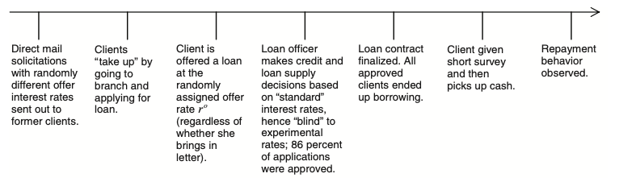

```{r 'check_ps', include=FALSE}

user.name = ''
```


# Credit Elasticities in Less-Developed Economics: Implications for Microfinance

Author: Finn Deike


Welcome to my interactive RTutor Problemset, containing the main results from the paper **Credit Elasticities in Less-Developed Economies: Implications for Microfinance** by Dean S. Karlan (Department of Economics, Yale University) and Jonathan Zinma (Department of Economics, Dartmouth College) published by the American Economic Review in 2008.

The paper, the data and a supplemental appendix are available online at the following websites:
- **Paper:** https://www.aeaweb.org/articles?id=10.1257/aer.98.3.1040
- **Data:** https://assets.aeaweb.org/asset-server/articles-attachments/aer/data/june08/20070848_app.pdf
- **Appendix:** https://assets.aeaweb.org/asset-server/articles-attachments/aer/data/june08/20070848_app.pdf


## Exercise Content

1.    Introduction

2.    Experimental Design and Data Overview

3.    Randomization Process Validation

4.    Theoretical Model

  4.1   Price Sensitivity of Loan Take-Up

  4.2   Price Sensitivity of Loan Size

5.    Pricing Strategy

6.    Conclusion

7.    References


This interactive problem set consists of a reproduction of the results of the above-named paper. The results are reproduced in code chunks, theoretical explanations, info boxes and quizzes. The procedure is very simple. You will solve tasks by entering or editing R code chunks and/or answer short quizzes. Before solving any task you have to press the `Edit`-button to be able to edit the code chunk. After editing the chunk or answering a quiz question, you have to press `Check`-button to get a feedback whether you answer is correct or incorrect. Sometimes exercises are more difficult and you might need an advice to solve the task, in this case you can press the `Hint` button to get further advice. Besides code chunks and quizzes the problem set composes of info boxes. The info boxes provide you with additional information of variables and explanations of statistical models or R commands.

Good work and patience will be awarded with interesting awards which include some additional information on exercise related topics!


## Exercise 1 -- Introduction

*“If you go out into the real world, you cannot miss seeing that the poor are poor not because they are untrained or illiterate but because they cannot retain the returns of their labor. They have no control over capital, and it is the ability to control capital that gives people the power to rise out of poverty.”*

― Muhammad Yunus, Banker to the Poor: Micro-Lending and the Battle Against World Poverty ("https://microfinancingafrica.org/10-profound-quotes-about-microfinance/")

Muhammad Yunus is a Bangladeshi social entrepreneur, banker, economist,civil society leader and Nobel Prize winner. He is one of the pioneers of microcredit and microfinance and the founder of the "Grameen Bank" which is also known as "The Bank of the Poor". In his book "Banker To The Poor" (1997), Yunus describes how he devoted to the "Grameen Bank" to provide the poorest people of Bangladesh with minuscule loans. The quintessence of the book implies that a small amount of credit can transform the lives of the poorest people in the world tremendously.

The book inspired me to find out more about lending micro credits to the poorest in the world and therefore I decided to replicate the paper **Credit Elasticities in Less-Developed Economies: Implications for Microfinance** by Sean S. Karlan and Jonathan Zinma in my Bachelor thesis.

Over three billion people in developing countries are still without effective access to loan and deposit services. The problem is particularly acute in Sub-Saharan Africa, where only between five and twenty-five percent of households have a formal relationship with a financial institution. The region is also home to just two percent of the world’s microfinance institutions.
Lack of access to financial services is therefore one of the largest constraints to private sector development in Africa. Addressing this shortfall requires creating new institutions and building operational and managerial capacity from the ground up. (IFC)
Though, providing  access  to  microcredit  is  expensive  for  lenders  in  view  of  the  high transaction costs relative to the small  amounts borrowed. Therefore,  to encourage micro-lending, profit-driven microfinance organization, including retail and furniture stores, are permitted to charge interest rates that are higher than those payable in respect of debt procured from the formal financial sector. Cash lenders focusing on high-risk segments often charge 30 percent interest per month on a one month maturity loan. Lenders in the informal sector do charge even more, around 30 to 100 percent interest per month. Which seems extremely high compared to lenders targeting low-risk markets where they partially charge less than three percent per month on a 12+ maturity loan.

Another explanation for this could be, that microfinance institutions (MFI) are often forced to increase interest rates to eliminate reliance of subsidies by policymakers. Though, this only makes sense if the poor are actually insensitive to interest rates. Otherwise increasing interest rates would limit the access. Many economic model suggest that loan pricing is tightly related to reliance on subsidies and therefore also to the functioning of the MFI market. However there is little evidence indicating interest rate sensitivities in MFI markets.

Therefore we will replicate the testing of Sean S. Karlan and Jonathan Zinma on the hypotheses of price inelastic demand for consumer credit using randomized trials conducted by a high-risk consumer lender in South Africa. Furthermore, we will examine the optimal pricing strategy of the lender in terms of profit maximization. The field experiment is based on randomized individual interest rate and maturity direct mail offers to more than 50,000 former clients of the lender based on the client's prior rate.

The problem set consists of various exercises, each exercise covers one or more topics. In the first exercise we will get to know the experiment and have a look at our data set. This includes information of the specific loan offers and client characteristics. The next section validates the integrity of the randomly assigned mail offer letters using different statistical test. After that we will explain the theoretical model. Using the theoretical model, we will estimate price elasticities of demand for consumer credit in respect to price and loan size. In the last section we will examine the optimal short-run pricing strategy for the lender by determining the costs of reducing and increasing the loan price.  
 
Good luck and have fun solving this interactive problem set to increase your knowledge about micro credit lending in South Africa!

## Exercise 2 -- Experimental Design and Data Overview

In this first section we will explain the experiment and get to know the data we use in this interactive R-Problemset.

### Experimental Design

The cooperating lender of Karlan and Zinma operated for more than 20 years as one of the largest and most-profitable micro lenders in South Africa. He competed in a cash loan industry segment that offer small, high-interest, short-term uncollateralized credit fixed monthly repayment schedules to the working poor population.

The experiment was conducted via a direct mail solicitation in form of pre-qualified limited-time offer letters that were mailed to 58,168 former clients of the Lender with good repayment histories and which did not have a loan with the Lender as of 30 days prior to the mailer. The offer letters clearly stated an interest rate and maturity, both randomized by the lender, and a loan size based on the clients last loan size. Most of the offers were at relatively low rates. The individual rate for each client was randomly assigned based on the distribution for each risk category because risk determined the loan price under standard operations. The categories for a standard risk schedule for four-month loans were subdivided into low-risk (7.75% PM), medium-risk (9.75% PM) and high-risk (11.75% PM). The maturity randomization was orthogonal to the offer rate randomization. But the difference was that only low- and medium-risk clients received the suggestion randomization. Those who were eligible for the suggestion randomization or in other words maturities longer than four month, received a randomized sample maturity of six or twelve month. High-risk clients were not able to choose higher maturities than 4 months. The only value which was presented on the offer letter and was not randomized was the loan size. The loan size was equal to the last loan size of each client. The experiment was carried out in three mailer waves of start dates grouped by different branches geographically. First a pilot test in three branches in July 2003, and than the experiment was expended to the remaining 83 branches divided into two more mailer waves in September 2003 and October 2003. 

Each offer contained a deadline between two to six weeks. An offer was accepted by a client by entering a branch office and filling out the application with an loan officer. The loan applications were evaluated per the lenders standard procedure independent of the experimental rates. Following the estimation of the loan officer the clients were assigned a proportional loan size and maturity.
The following graphic shows the operational steps of the experiment in detail:



Fig 1. Source: Karlan, Dean S. and Zinman, Jonathan, "Credit Elasticities in Less-Developed Economies: Implications for Microfinance" (2008)

### Data Overview

The main data set of the experiment is named **_kz_demandelasts_aer08.dta_**. The ending `.dta` indicates that it is a Stata file. The data set contains data of only the clients who actually received an offer letter from the lender. In fact 1,358 mailers were returned to the lender by the postal service and 3,000 contained atypical relationships between the offer rate and maturity. This leaves a data set of 53,810 clients. The information of the clients range from experimental variables to demographic characteristics. Before we can take a look at our data set **_kz_demandelasts_aer08.dta_**, we have to read in the Stata data file with the R-function `read_dta()` from the `haven` package. However, we must load the package at first to be able to use the function.

```{r eval=FALSE}
# Run for additional info in the Viewer pane
info("How do we read a Stata File in R?")
```

1.1)  First load the package `haven` with the `library()` command. If you think your answer is right press `check`:

```{r "3_1"}
# Load the package with the library() command
```

1.2) Now you can use the command `read_dta()` to load the data file _kz_demandelasts_aer08.dta_ and store it in the variable `dat`.

```{r "3_2"}
# 
___ <- ___("kz_demandelasts_aer08.dta")
```

After loading in the data, we can now have a deeper look into our data and the according parameters stored in `dat`.

There are a variety of ways to get an overview on a data set. We will use the R function `head()`to show the first six rows of our data set stored in `dat`. An alternative would be to show six random sample rows, by using the command `sample_n(data,rows)`. This will help us to get familiar with the variables and understand how the data set is structured.

1.3) Show the first six rows of our data file stored in `dat`. Afterwards press the `check` button it will execute the function and show you if you are right or wrong:

```{r "3_3"}
# Use the function head() to show the first six rows of the data frame
```

As you can see for some variables the `head()` command returns NA. This is due the circumstances that a large proportion of clients did not ended up taking a loan. Therefore, values of variables such as `loansize`, which is the loan size the client received from the lender, are not available. However, we can have a look at a sample frame of only clients who actually took up a loan (`tookup`) to get a better overview of our data. To do so we have to extract the clients who borrowed from the lender from the data frame using the function `filter()` from the `dplyr` package.

```{r eval=FALSE}
# Run for additional info in the Viewer pane
info("Function: `filter()`")
```

1.4) Filter the main data `dat` using the `filter()` function with the condition `tookup == 1` to get sample data frame `dat_takeup` and show the first six rows of the sample frame `dat_takeup`. Evaluate your answer by pressing the `Check` button.

```{r "3_4"}
dat_takeup <- dat %>%
  filter(tookup == 1)

head(dat_takeup)
```

It shows us six rows of the sample data frame where each row typifies one of the 58,168 clients from 86 mostly urban branches who had borrowed from the lender in the past 24 months, and did not currently have a loan from the lender. Furthermore we can see 54 columns. Every column stands for one variable. We are going to take especially a look at series of experimental variables. These include inter alia the three rates which were assigned to each client: `offer4` the randomized individual interest rate directed mail offer, `final4` the contract rate that was slightly less than the offer rate and `yearlong` the dynamic repayment incentive that extended preferential contract rates for up to one year.
In addition the three example maturities presented in some mailers `termshown4`, `termshown6` and `termshown12` (four, six and twelve month), which give a prediction of the actual maturity chosen.
The variables `tookup`, `applied` and `onetermshown` presents those clients who borrowed, those who applied and those who were eligible for the maturity suggestion randomization. As well as described above, the loan size which is described by the variable `loansize`.

More over we will examine demographic characteristics like: `female`, `married`, `age`, `edhi` (more educated), `rural`, `dependants` (number of dependants), `grossincome` (gross monthly income 000s of rand), `trcount` (number of loans with the lender), `dormancy` (number of months since the last loan with lender) and the three risk categories `low` (low risk), `mid` (medium risk) and high risk (neither `med` or `low`). 

We will examine the most important variables in the following exercises.


### Data Analysis

To begin with, we want to answer the question: how many clients applied for the loan on time and actually were assigned to borrow from the lender?

To answer this question we can create an overview over clients who were intended to receive an offer letter (58,168), those who actually received an offer letter (full sample frame), those who applied for a loan (`applied`) and those who ended up taking a loan (`tookup`) in a bar plot using the `ggplot2` package.

1.5) Just press `Check` to create the bar plot.

```{r "3_5"}

rec <- 58168
full <- nrow(dat) 
app <- sum(dat$applied)
bor <- sum(dat$tookup)

bp_1 <- data.frame(clients = c("Intended to Recieve", "Recieved an Offer Letter", "Applied", "Borrowed"),
                   number = c(rec, full, app, bor))

ggplot(bp_1, aes(x=reorder(clients, -number), y=number)) + 
  geom_bar(stat = "identity", position=position_dodge(), width=0.8, fill = c("darkgreen", "green4", "green3", "green")) +
  geom_text(aes(label=number), vjust=1.8, size=3) +
  labs(title = "Clients Overview", y="Number of Clients") +
    theme(axis.title.x = element_blank())
```

The bar plot shows us that we have 58,168 who were intended to receive an offer letter and 53,810 who actually received one. As mentioned earlier, the difference can be attributed to the fact that 1,358 mailers were returned to the lender by the postal service and 3,000 contained atypical relationships between the offer rate and maturity. Furthermore, 4,450 clients applied for a loan which corresponds to an application rate of 8.4 percent. Of those clients, 86 percent or rather a total of 3,887 were approved for a loan.

Now we want to take a look at the randomized individual interest rate directed mail offer `offer4`. The offer rate was stratified by the clients pre-approved risk category. Before we take a look at the distribution of offer rates for the clients of each risk category, we we want show the distribution of the offer rate for the whole data frame unconditional on risk with a simple box plot using the `ggplot()` and `geom_boxplot()` functions from the `ggplot2` package. The boxplot will show us the distribution of the offer rate based  on the minimum, maximum, median and the first and thrid quartiles.

```{r eval=FALSE}
# Run for additional info in the Viewer pane
info("ggplot()")
```


1.6) Replace the question marks with the missing values and functions to create a box plot of distribution of the offer rate. If you think your answer is right press the `Check` button.
```{r "3_6"}
dat %>%
  ggplot(aes(x="Full Data Set", y=???)) +
  ??? +
  stat_summary(fun = mean, geom = "point", size=3, col="red", shape=18)

```
The box plot shows us the distribution of the offer rate. We can see that the median and average value of the offer rate are approximately at 8 percent per month. The minimum offer rate is at slightly above 3 percent and the maximum at slightly below 15 percent. Furthermore, the fist and third quartiles are at around 6 percent and 10 percent.

These determinations are vague estimates of the graphic. But we can have a more detailed look at the distribution by using simple mathematical operations. But this time conditional on the risk category.

```{r eval=FALSE}
# Run for additional info in the Viewer pane
info("Mathematic Operations")
```

1.7) Calculate the minimal (`min_value`) and maximum (`max_value`) values of the offer rate in regarding the risk categories by using the `group_by()` function and mathematic operations. To do so create a new data frame `values`. If you finished the task press `Check`.
```{r "3_7"}
values <- dat %>%
  group_by(???) %>%
  summarise(min_value=???(offer4), max_value=???(offer4))

values

```

The data frame shows that the offer rates very from 3.25% to 14.75%.

An interesting function to look at the distribution of rates is `geom_density()`. The function is part of the package `ggplot2`. The package is used for creating elegant data visualizations and is based on "The Grammar of Graphics". `geom_density()` is often used in combination with the function `ggplot()` which is also a part of the `ggplot2`package. We want to create a density estimate of the offer rate in relation to the three risk categories.

1.8) To create a density estimate of the offer rates, just press the `Check` button.
```{r "3_8"}
dat %>%
ggplot(aes(x=offer4, group=risk, fill=risk)) + 
  geom_density(adjust = 1.5, alpha = 0.4) +
  scale_fill_discrete(name = "Risk Category", breaks = c("LOW", "MEDIUM", "HIGH")) +
  xlab("Randomized Offer Rate (%)") +
  ylab("Density") +
  geom_vline(xintercept= c(7.75, 9.75, 11.75), col = c("green", "blue", "red"))
```

The graphic shows the distribution of the offer rates of the clients in relation to their risk category. We can see that the interest rates of all clients are mostly under their categorical standard schedule. The lowest randomized offer rate is slightly higher than 3% per month and the highest is slightly lower than 15% per month. If we consider the different risk categories it becomes apparent that a offer rate of a low risk client has the highest density between slightly less than 6% and slightly more than 7% at around 0.3. If we now have a look at clients of the medium risk category we see that the offer rate has the highest density between 7% and a bit more than 9% having a ratio of about 0.22. Whereas the density of high risk category is the highest at about 7.5% and between 9% and 11% at 0.16.


Another aspect that could by interesting is to analyze the geographic circumstances. Our data frame `dat` contains a column named `province`, which contains the province in which the applicant applied for a loan. Hence we can create a new data frame grouped by the provinces by using the functions `group_by()` and `summarise()`.

```{r eval=FALSE}
# Run for additional info in the Viewer pane
info("Function: group_by() & summarise()")
```


1.9) Group the data frame `data` by the `province` the applicant applied in using the function `group_by()`. The filter condition is already given. The new data frame should be named `zaf`. than use the function `summarise()` to apply the given operations for each group. Afterwards show the new data frame `provinces`. 
```{r "3_9"}
___ <- ___ %>%
  filter(tookup == 1) %>%
  ___ %>%
  ___("Average Interest Rate" = round(mean(offer4, na.rm=TRUE),3),
                                                      "Average Offer Rate" = round(mean(final4, na.rm=TRUE),3),
                                                      "Average Dynamic Repayment Incentive" = round(mean(yearlong, na.rm=TRUE),3),
                                                      "Average Loansize" = round(mean(loansize, na.rm=TRUE),3),
                                                      "Average Maturity" = round(mean(term, na.rm=TRUE),3),
                                                      "Number of Clients" = sum(tookup)
                                                      )

# show the data frame


```

As you can see our newly created data frame is grouped into eight provinces. Tough South Africa is actually divided into nine provinces, the province Northern Cape is missing because no client applied for a loan in this province. We want to create an interactive map of South Africa later in this problem set, therefore we have to add the province *Northern Cape* to our data frame `provinces`.

1.10) Just press `Check` to add the Northern Cape to the data frame.

```{r "3_10"}
provinces <- rbind(zaf, c("Northern Cape", NA, NA, NA, NA, NA, NA))

provinces$province <- c("Eastern Cape", "Free State", "Gauteng", "KwaZulu-Natal", "Limpopo", "Mpumalanga", "North West", "Western Cape", "Northern Cape")
names(provinces)[names(provinces) == "province"] <- "NAME_1"
```

As you can see the provinces of South Africa are: Eastern Cape, Free State, Gauteng, KwaZulu-Natal, Limpopo, Mpumalanga, Northern Cape, North West and Western Cape. 

Before we continue with our analysis, try to answer the short question:


Quiz: Why did so many clients applied for a loan in Gauteng and none in the Northern Cape?

[1]: The Northern Cape is a highly urbanized province and Gauteng consists mostly of sedimentary rocks.
[2]: Gauteng is a highly urbanized province and the Northern Cape consists mostly of sedimentary rocks.

```{r eval=FALSE}
# Run line to answer the quiz above
answer.quiz("Urbanization")
```

The provinces  of South Africa vary substantial in size. The smallest but most crowded one is Gauteng. The province of Gauteng is a highly urbanized region. It includes the cities of Johannesburg, Ekurhuleni (East Rand) and Pretoria. Which are three of the five largest cities in the country. On the other hand the largest but most sparsely populated province is the Northern Cape. For comparison the province is slightly larger than Germany (Government of South Africa: "South Africa's Provinces", at: https://www.gov.za/about-sa/south-africas-provinces, retrieved 20 January 2021).
To get a better idea of what we are talking about, let us import the data with the population of every province. 
In order to do this we can add a new variable or rather column to the data frame called `population`. A helpful function to add a variable to a data frame is called `mutate`.

```{r eval=FALSE}
# Run for additional info in the Viewer pane
info("Function: mutate()")
```

1.11) Add a new column to our existing data frame `provinces` which includes the population of each province using the `mutate`function. You can use the given vector c(6734001, 2928903, 15488137, 11531628, 5852553, 4679786, 4108816, 7005741, 1292786) as the values we want to assign to the new variable `population`. If you finished the task, press `Check`.

```{r "3_11"}
# Replace the question marks with your answer
provinces <- ???(??? = ???)
```

The population data is provided by the South African government. Check out https://www.gov.za/about-sa/south-africas-provinces# for more information.

1.12) Press Check in order to get a interactive map of South Africa. The color portrays the average interest rate and the bubble size the population of the selected province. You ca get information about a province by just clicking on it.
```{r "3_12",output='htmlwidget', widget='leaflet'}

library(sf)
library(ggplot2)
library(tmap)
library(tmaptools)
library(leaflet)
library(dplyr)
# set options so numbers don't display as scientific notation
options(scipen=999)

# reads the features from the shapefile
mymap <- st_read("~/Documents/GitHub/thesis_code_rep/gadm36_ZAF_shp/gadm36_ZAF_1.shp", stringsAsFactors=FALSE)

# joining the data of the shapefile and our dataframe
map_data <- inner_join(mymap, provinces)

map_data$`Average Interest Rate` <- as.numeric(map_data$`Average Interest Rate`)
map_data$`Average Loansize` <- as.numeric(map_data$`Average Loansize`)

mymap <- tm_shape(map_data) +
  tm_polygons("Average Interest Rate",
              id = "NAME_1",
              style = "quantile",
              palette="Greens",
              popup.vars=c("Population", "Number of Clients", "Average Interest Rate",  "Average Offer Rate", "Average Dynamic Repayment Incentive","Average Loansize", "Average Maturity")) +
  tm_bubbles(size = "Population", col= "black", id="NAME_1", scale = 2) +
  tm_borders() +
  tm_scale_bar()


tmap_leaflet(mymap)
# tmap mode set to interactive leaflet map
```


The map gives us information about how the clients are geographically distributed. We can see that a majority of the clients are from the Gauteng and KwaZulu-Natal provinces which are also the provinces with the most residents which is portrayed by the size of the black bubbles. As mentioned earlier we have no clients in the Northern Cape and only 1 in the North West. If we take a look at the average interest rates, which is portrayed by color, we see that it varies from 7.18 in KwaZulu-Natal to 10.49 in North West. However, the average interest rate in North West is not very informative, because as we know, there is only one client in North West. The average interest rates of the remaining provinces are very similar. For further information, just click on the province you want to get more information about.

## Exercise 3 -- Randomization Process Validation

In the last section we loaded in the data file, got a rough look at our data and created a interactive map of South Africa.
Now, we want to find out more about the experiment. In this part details we will discuss the experimental design, implementation and the validation of the random assignments.
We will take a look especially at the earlier utilized interest rate `offer4`. 

2.1.1) To load in the data just press `Check`.
```{r "4_1"}
dat <- read_dta("~/Documents/GitHub/thesis_code_rep/kz_demandelasts_aer08.dta")
dat <- dat %>% mutate(itcscore_100 = itcscore/100, appscore_100 = appscore/100)

```

We want to find out more about the interest rate variable `offer4`. In this part of the section we will inspect the correlation of `offer4` and `maturity`, conditional on the risk category, with other observable variables and check if the randomization process was successful.

Early it was mentioned that the assigned rates are uncorrelated with other given information such as the external or internal credit score. Thus let us check if this assumption corresponds with the reality. We will now do a simple linear regression with the `lm()` function and check if the offer rate is actually unrelated to other observable characteristics. The value we will look at the closest is the **p-value**.

```{r eval=FALSE}
# Run for additional info in the Viewer pane
info("Linear Regression with lm()")
```

The p-value will give us information about the outcome of the randomization. If our hypothesis is correct, the p-value will be comparatively high for each variable and higher than the significance level.

We will also add control variables of the month of the offer(`waved2`, `waved3`) and the lender-defined risk level of the client prior to the experiment (`low`,`med`) and further characteristics of the client, to avoid endogeniety problems. Control variables are variables which are hold constant during an experiment. They are neither dependent or independent variables. Control variables are not part of the experiment itself but yet they still may influence the outcome of the experiment.

2.2.1) Task: Regress the offer rate `offer4` on the given variables using the `lm()` regression and store it in the variable `reg2_1`. To do so, replace the question marks of the given code with you answer.
```{r "4_2"}
reg2_1 <- ???(??? ~ dormancy + lntrcount + female + dependants + married + lnage + rural + edhi + itcscore_100 + itczero + appscore_100 + low + med + waved2 + waved3, data=dat)

summary(???)

```

```{r eval=FALSE}
# Run for additional info in the Viewer pane
info("Evaluation of a Linear Regression")
```

In fact the p-value of all observable variables is significantly higher than the significance level. Which indicates that indeed the offer rate is highly likely independent of the other observable characteristics and thus the randomization process was successful.

We can also portray the changes that different explanatory variables have on the dependent variable in a regression model with the function `effectplot()` of the `regtools` package. The basic concept of an effect plot is to compare the effects of the explanatory variables if they change from their 10 percent to their 90 percent quantile or for binary variable the effect of changing from 1 to 0. To create an effectplot, we just have to add our regression into the function braces `effectplot(.reg)` (For further information checkout: https://github.com/skranz/regtools/blob/master/man/effectplot.Rd).

2.2.2) Create an `effectplot()` of our regression `reg2_1`. Afterwards, press the `check` button.
```{r "4_3"}
# Create an effectplot using the effectplot() function of the regression reg2_1

```

The effectplot confirms our assumption, that the randomization process was successful. The only explanatory variables which influence our response variable significantly are the controll variables of the month of the offer and the risk category of the client.

Since we just learned, that it is reasonable to assume that the randomization process was successful, we will no check if the offer rate below or at the standard rates did influence the clients who borrowed after the given deadline. For this we will use a **probit regression** which is very similar to simple linear regression. The difference is that a probit regression is a binomial regression which means the outcome is either a success (1) or a failure (0). Where in linear regressions the outcome is scale or rather numerical.

```{r eval=FALSE}
# Run for additional info in the Viewer pane
info("Probit Regression with glm()")
```

The theoretical model of a probit regression will be explained more in detail in exercise 3.

2.2.3) Use a generalized regression model to apply a probit regression on the `tookup_afterdead_enforced` (take-up after the deadline) with the offer rate. To Change the code from a simple linear regression to a generalized linear probit regression. If you need help press **hint**.
```{r "4_4"}
reg2_2 <- lm(tookup_afterdead_enforced ~ offer4 + low + med + waved2 + waved3, data=dat)
summary(reg2_2)

```

As we can see the p-value is 0.851 which is considerably higher than the significance level which substantiates that offer rates at or below the standard rate did not influence the take-up after the deadline. This seems conclusive since the clients borrowed at the standard rate schedule after the deadline.

We can also observe the relationship between the take-up after the deadline and the offer rate from a graphical point of view. Therefore we will use the `ggplot()` function again to declare the input data frame, than we will utilize the `stat_smooth()` (will be explained later in detail) to plot our probit regression `reg2_2`.

2.2.4) Plot the probit regression `reg2_2`. Just press Check.
```{r "4_5",error=FALSE, results='asis'}
ggplot(dat,aes(x=offer4 + low + med + waved2 + waved3, y=tookup_afterdead_enforced)) + 
  stat_smooth(method='glm',family=binomial(link='probit')) +
  ylim(min=0, max=1) +
  ylab("Borrowed after the deadline") +
  xlab("Offer Rate")
```

The graph corroborates our thesis since there is no clear tendency that the probability of a take-up after the deadline increases or decreases with a higher offer rate.  

In addition we want to find out if the rejection decisions of the clients were correlated with the offer rate awarding process. The approach is the same as the previous regression. However this time we have to reduce the data frame to only clients who applied for a loan. Furthermore we will add a new function called `stargazer()` to get a nicer output table which holds the regression results of all three regressions.

```{r eval=FALSE}
# Run for additional info in the Viewer pane
info("stargazer()")
```


2.2.5) Execute the Regression `reg2_3` than use the function `stargazer()` to create a nicer-looking output table of the regression. We want to set `type="html"` and `header=FALSE`. If you need a little hint, press `hint`.
```{r "4_6",error=FALSE, results='asis'}
reg2_3 <- glm(rejected ~ offer4 + low + med + waved2 + waved3, family = binomial(link = "probit"), data=filter(dat, applied == 1))

stargazer(???)

```

We see that the p-value is once again substantially higher than the significance level which corroborates that the rejection decision was not influenced by the offer rate.

To sum up everything that has been stated so far we found out that our randomization process is was successful not affected by other observable characteristics.


## Exercise 4 -- Theoretical Model

It the first two sections we got familiar with our parameters and verified the randomization process. Now we want to comprehend the empirical strategy.

### Basic Model

So far we learned a lot about our data and the randomization process thus in this section we will apply our newly acquired knowledge to map our data into testable predictions. In the narrow sense we are interested in the response of loan demand to changes in price and maturity. Our basic model for the estimation is the following: $$y_i = f(C_i, X_i)$$
In our model **$y$** measures the extensive (`take-up`) and intensive (`loansize`) demand. While **$i$** indicates one of the 53,810 borrowers. The variable **$C_i$** is a vector including the offer rate (**$r_i$**) and the maturity (**$m_i$**). The variables we used for the randomization process of **$r_i$** - the pre-approved risk category (low/medium/high) and the mailer wave (July/September/October) - are included in **$X_i$**.

### Linear Probability Model

We often use binary variables as independent variables in regressions. But in our case we want to use a binary variable as a dependent variable. This means it is either 1 if something occurs or zero otherwise. It is possible to use the ordinary least squares method (OLS) in which the dependent variable $y$ is binary. It is called the **Linear Probability Model** (LPM). The LPM is an OLS method with a continuous dependent variable: $$Y_i = \beta_0 + \beta_1{X_1} + ... + \beta_k{X_{ki}} + \epsilon_i$$ To analyze the model we take a look at the conditional expectation of the dependent variable **$Y$** and we see that: $$E[Y|X] = P(Y=1 | X)$$ Now we can use this assumption to describe the model above, we assume that: $$E[Y|X] =  \beta_0 + \beta_1{X_1} + \epsilon_i = P(Y=1 | X) = y$$ Since the expectation of the error term **$\epsilon_i$** given we have **$X$** is **0**. The change in probability associated with a change in **X** to **$X+1$** equals a probability change by the factor of **$\beta_1$**. In other words the coefficient **$\beta_i$** can be interpreted as the change in **$Y$** associated with a unit change in **$X_i$** or the predicted probability of having $y=1$ for the given values of $x_1...x_k$.

However the classic LPM has a fundamental problem. We will shows this by using the `mtcars` data set which is included in the `dplyr`-package. The following plots will show the difference between a LPM and a Probit or Logit model and why probit or logit models are better suited future regressions. Just press check to have a look at the following plots to answer the question bellow:

```{r "5_1"}

lm_plot <- ggplot(mtcars, aes(x=mpg, y=vs)) + geom_point() + 
  stat_smooth(method="lm", se=TRUE) +
  geom_hline(yintercept=0, col="red") +
  geom_hline(yintercept=1, col="red") +
  ylim(-0.25, 1.5) +
  ggtitle("Linear Probability Model")

probit_plot <- ggplot(mtcars, aes(x=mpg, y=vs)) + geom_point() + 
  stat_smooth(method="glm", method.args=list(family="binomial"(link="probit")), se=TRUE) +
  geom_hline(yintercept=0, col="red") +
  geom_hline(yintercept=1, col="red") +
  ylim(-0.25, 1.5) +
  ggtitle("Probit Model")

logit_plot <- ggplot(mtcars, aes(x=mpg, y=vs)) + geom_point() + 
  stat_smooth(method="glm", method.args=list(family="binomial"(link="logit")), se=TRUE) +
  geom_hline(yintercept=0, col="red") +
  geom_hline(yintercept=1, col="red") +
  ylim(-0.25, 1.5) +
  ggtitle("Logit Model")

grid.arrange(lm_plot, probit_plot, logit_plot, ncol=2)
```


Quiz: What could be the problem with the Linear Probability Model?

[1]: It is not possible to use the LPM if the dependent variable is binary.
[2]: In an LPM it is possible to get a probability below zero or above 1.
[3]: There is no problem with the LPM.

```{r eval=FALSE}
# Run line to answer the quiz above
answer.quiz("LPM")
```

As you see in the plots above, Probit and Logit models are better fitted for a regression with a binary dependent variable. They are in fact specifically made for regression with a binary dependent variable and always results in a probability between zero and 1. Now we have to choose between the probit and logit model. The real big difference between the logit and probit model is the assumptions made about the error distributions. Logit assumes you have a logistic error distribution while probit assumes you have a normal error distribution. Since their is a lot more known about the normal error distribution, we will use the probit model in our future regressions with a binary dependent variable. Now we are able to use this to analyze the response of loan demand to changes in price and maturity.

### Probit Model

A difficulty with estimating loan demand elasticities is that the contract terms are often subjected to external influences, such as alternative financing opportunities or other supply decisions. As far as the price sensitivity we approached the problem be randomizing the interest rate based on the clients risk category. This allows us to observe what happen if we change the loan price or in our instance the interest rate. To achieve this, we estimate a probit model of the form:

$$
a_i = \alpha + \beta{r_i} + \delta{X_i} + \epsilon_{ib}
$$

In our model $a_i$ is the independent variable `applied` which can be either **1** if the client $i$ applied for a loan or **0** if he or she did not. The offer rate `offer4` $r$ is orthogonal to the standard errors $\epsilon_{ib}$ by construction and therefore $\beta$ is an unbiased estimate of the price sensitivity of loan take-up from direct mail offers. We will assume that $\beta < 0$ since almost every model of consumer choice predicts that the demand is downward sloping with an increase in price.


Since you now learned a little bit about our theoretical model, let's do a short Quiz based on our data:


Quiz: What do you think would happen to the take-up if we would increase the interest rate by 100 basis-points? Just type "reduces" or "increases" in the blank box.

Answer: 

```{r eval=FALSE}
# Run line to answer the quiz above
answer.quiz("Basic Interpretation")
```

In the next section we will deal with this subject more intensively. 

## Exercise 4.1 -- Price Elasticity of Loan Take-Up

So war far we talked a lot about our data set and our theoretical strategy. But in this section we want to get our first tangible results. In fact in the first part of exercise 4, we will be estimating the price elasticity of loan demand.

4.1.1) Since this is a new exercise, press `Check`to load in the data once again.
```{r "6_1"}
dat <- read_dta("~/Documents/GitHub/thesis_code_rep/kz_demandelasts_aer08.dta")
```

### Extensive Margin

As we mentioned in the last section we are using a probit model to estimate the price elasticity of loan demand. We begin with borrowers who applied for a loan before the deadline ended. Tough instead of the `lm()`-function, we will use the generalized linear model function `glm()` because it enables us to perform a probit regression. 

#### Marginal Effects

We want to start with a regression limited to clients who received offers at or below the standard rate of their risk category. In the second regression we want to focus on clients who received a higher rate than their interest rate under standard operations. The variable `normrate_less()` indicates if a client recieved a offer rate at or below their interest rate under standard operations (1) or not (0). As a reminder, the interest rate per month under standard operations for a low risk client was 7.75 percent, for a medium risk client 9.75 percent and for a client of the high risk category 11.75 percent. To do so we have to reduce the data set to only the clients who received a offer at or below their standard rate of their risk category (`normrate_less == 1`) with the `filter()` function. Recall that `applied` is our binary dependent variable and `offer4` and the experimental validation variables `low`, `med`, `waved2`and `waved3` are our explanatory or rather independent variables.

4.1.2) Use `glm()` to perform our first Probit regression. Regress `applied` on `offer4`, `low`, `med`, `waved2` and `waved3` and filter our data set `dat` for `normate_less == 1`. Store this regression in `reg3_1`. Afterwards display the regression results with the `summary()` command. Finally press `Check` or if you need help press `hint`.
```{r "6_2",error=FALSE}
# Perform a Probit regression and show the regression results

```

From our computed summary we can see that the offer rate `offer4` is significant at the 0.1 percent level which means that a coincidental connection between `applied` and `offer4` is very unlikely. Unfortunately a probit output is not equal to the marginal effects. Though we can say that an increase of the offer rate by 100-basis-point is negatively associated with the loan take-up. Suggesting that clients who received an offer at or below the standard rates are less likely to apply if the offer rate would be 100-basis-points higher. We get similar results if we examine the opposite group of clients, those who received an offer rate higher than their standard ones (`normrate_more == 1`), in the regression `reg3_2` below (we remove the control variables `waved2` and `waved3` from the regression, because no client who were assigned a higher offer rate than standard for their risk category received an offer in the second or third mailer wave). The lender was primarily interested in testing price sensitivities of low rates and therefore only 632 client received a higher than standard rate.

4.1.2 b) Just press `Check` to perform the regression.
```{r "6_3",error=FALSE}
reg3_2 <- glm(applied ~ offer4 + low + med, family = binomial(link = "probit"), data=filter(dat, normrate_more == 1))
summary(reg3_2)
```

In order to interpret the results more precisely, we will now calculate the corresponding marginal effects of both regressions. To do this we are using functions from the `regtools` package. In particular the `showreg()` function which can show marginal effects in a `glm` model and it allows for robust standard errors 

```{r eval=FALSE}
# Run for additional info in the Viewer pane
info("showreg()")
```

4.1.3) Just press `Check` to perform the two above explained regressions and show the marginal probit effects of the two regressions.
```{r "6_4",error=FALSE, results='asis'}
showreg(list("(1)"=reg3_1,"(2)"=reg3_2), coef.transform=c("mfx", "mfx"), omit.coef = "(Intercept)", digits=3, type="html")
```

Column (1) presents the probit marginal effect of clients who received offers at or below the standard rate of their risk category. A 100-basis-point increase in the monthly interest rate can be associated with reduced take-up by 0.3 percentage points. This seems to be a very small effect since we know from exercise 2 that the price ranges between 3.25% and 11.75%. This means that price decrease from the maximum to the minimum would increase the take-up by only 2.6 percentage points ((11.75%-3.25%)*-0.003 = 0.026). In column (2) we can see that a 100-basis-point increase in the monthly interest rate has a higher effect on clients who received offers higher the standard rate of their risk category. In this case the price increase results in a 1.7 percentage points lower take-up. This means that the effect or rather the price sensitivity is nearly six times higher for clients who received offers above their risk category.

To estimate if the price sensitivity changed when the lender offered higher than the clients standard rate, we have to regress `applied` on `normrate_more` and the experimental validation variables. The regression shows that higher interest rates reduced the level of take-up. Clients who received a higher than standard rate were 3 percent less likely to apply for a loan.

4.1.4) Press `Check` to perform the regression and present the probit marginal effects.
```{r "6_5",error=FALSE, results='asis'}
# Enter your code here.
```

#### Price Elasticity

Another way to classify the estimated results is to calculate the take-up elasticity. In a economic sense, the elasticity can be quantified as the ratio of the percentage change in one variable to the percentage change in another variable if a non-coincidental connection between the two variables exists. 

We can use our result to calculate the elasticity. To do so we need the average values of the response variable `applied` and the average value of the explanatory variable `offer4`. than we can use the formula for elasticity of demand:

**elasticity = marginal effect x (Ø explanatory variable/ Ø response variable)**


Quiz: Calculate the price elasticity of demand for our sub-sample in regression `reg3_1`. The mean offer rate is 8 and the mean of clients who applied is 0.085. Type in you answer in the box below rounded by two digits.

Answer: 

```{r eval=FALSE}
# Run line to answer the quiz above
answer.quiz("Price Elastcity of Loan Demand")
```

#### Graphical Analysis

We can illustrate the relationship between the monthly offer rate and an application or rather demand price sensitivity graphically in a **partial regression plot**. In a partial regression plot we compute the residuals by regressing the response variable `offer4` on the independent variables excluding `applied`. We than compute the residuals by regressing the independent variable `applied`on th remaining independent variables. The partial regression plot is a plot that 

We use another `geom-` function called `geom_smooth()`, to illustrate the marginal effects with a smoothing line. We also have to add `se=FALSE` and `method="loess"` into the `geom_smooth()` command. We set `se=FALSE` because we would get an overflow otherwise, knowing our data set is quiet large.

4.1.5) Replace the `geom_point()` function with the `geom_smooth()` and add the above mentioned conditions. Afterwards press `Check`.
```{r "6_6",error=FALSE}
# Enter your code here.
ggplot(dat, aes(x=x_resid, y=y_resid)) +
  geom_smootht(method="???", se=???, span=0.5)

```

The demand curve confirms our thesis that an interest rate decrease is associated with a higher loan size and an increased offer rate with a lower loan size. However, a kink at approximately an interest rate increase of 150-basis-points is particular noticeable. It shows that if we increase the interest rate by more than 150-basis-points the demand curve or rather the loan size falls strongly.

### Possible Explanations for the Kink

One explanation for the kink is selection based on rates of return. Since our sample consists only of prior borrowers, it could be that everyone in the experiment has a discount or return rate approximately equal to the Lender’s standard rates. Hence, prior borrowers were roughly indifferent about borrowing at their standard rate, and a rate increase leaves them strictly unwilling to borrow. There are two problems with this explanation. First, it delivers the counterfactual prediction that lowering the interest rate should affect only the intensive margin, since everyone in the sample had already demonstrated a willingness to borrow at standard rates. Second, it seems likely that rates of return for potential borrowers vary over time with the severity of liquidity constraints and opportunity sets. In this case, we would not necessarily expect to find an indifference point at standard rates, and it would be unlikely that selection on rates of return is a sufficient explanation for the kink.

#### Borrowing from an outside lender

A second explanation for the kink in the demand curve could be that clients borrowed elsewhere if the offer rate was to high. To test this hypothesis we will perform the same regression as in the previous tasks but this time we will only focus on clients who ended up borrowing from another financial institution. For this purpose the lender obtained credit bureau data and it is described with the variable `tookup_outside_only` in our data set.

4.1.5) Press `Check` to perform the regression of clients who borrowed from other financial institutions on the offer rate. Afterwards use the regression results to answer the question below.
```{r "6_7",error=FALSE, results='asis'}
reg3_4 <- glm(tookup_outside_only ~ offer4 + low + med + waved2 + waved3, family = binomial(link = "probit"), data = filter(dat, normrate_less == 1))

reg3_5 <- glm(tookup_outside_only ~ offer4 + low + med, family = binomial(link = "probit"), data = filter(dat, normrate_more == 1))

reg3_6 <- glm(tookup_outside_only ~ normrate_more + low + med + waved2 + waved3, family = binomial(link = "probit"), data = dat)

showreg(list("(4)"=reg3_4,"(5)"=reg3_5, "(6)"=reg3_6), coef.transform=c("mfx", "mfx", "mfx"), omit.coef = "(Intercept)",  digits=3, type="html", omit.stat = c("low", "med", "waved2", "waved3"))
```


Quiz: Did higher offer rates induce more borrowing from other financial institutions?.

[1]: A 100-basis-point increase can be associated with a 0.1 higher take-up from an outside borrower for clients at or below the standard rate and a decrease in take-up by -0.1 for clients who received offers higher the standard rate of their risk category.
[2]: There is no significant relationship between higher offer rates and borrowing from an outside lender.
[3]: A 100-basis-point increase can be associated with a -0.1 lower take-up from an outside borrower for clients at or below the standard rate and a increase in take-up by 0.1 for clients who received offers higher the standard rate of their risk category..

```{r eval=FALSE}
# Run line to answer the quiz above
answer.quiz("Borrowed Elsewhere")
```

The results in columns 4 and 5 suggest that there is a positive relationship between a higher offer rate and clients who received an offer rate at or below their standard ones and ended up borrowing from another financial institution. As well as a negative relationship for clients who received a higher offer rate than the standard for their risk category. In addition (6) indicates that a higher offer rate strengthened the take-up from other financial institutions. However the confidence intervals rule out economically large substitution. Therefore we can not say that higher interest rates influenced the borrowing behaviour of clients in respect to borrowing from other financial institutions. Hence, we cannot rule out other financing opportunities like i.e. family, friends or moneylenders.

#### Borrowing after the deadline

There is another possible explanation for the kink in the demand curve. Clients could have borrowed after the deadline if their offer rate was higher than the standard rate and than borrow at the lower rate. This is testable by examining the post-deadline borrowing behaviour of the clients. A logical outcome would be that clients with a higher offer rate than the standard rate will borrow after the deadline expired. In order to test this hypothesis we will perform the regression once again, but this time soley with clients who borrowed after the deadline. To find out which variable describes those clients press the `data` button.

4.1.6) This time you only have to replace the question marks with the variable which indicates if clients borrowed after the deadline. If you think your answer is correct press `Check`. If you can not find the variable in `data` just press `hint`.
```{r "6_8",error=FALSE, results='asis'}
reg3_7 <- glm(??? ~ offer4 + low + med + waved2 + waved3, family = binomial(link = "probit"), data=filter(dat, normrate_less == 1))

reg3_8 <- glm(??? ~ offer4 + low + med, family = binomial(link = "probit"), data = filter(dat, normrate_more == 1))

reg3_9 <- glm(??? ~ normrate_more + low + med + waved2 + waved3, family = binomial(link = "probit"), data = dat)

showreg(list("(7)"=reg3_7,"(8)"=reg3_8, "(9)"=reg3_9), coef.transform=c("mfx", "mfx", "mfx"), omit.coef = "(Intercept)", output = "html", digits=3)

```

In fact, we get a unexpected result - higher offer rates are associated with less post-deadline borrowing. The result of the regression `reg3_8` in column (9) indicate that higher offer rates lead to -0.036 percentage points less post-deadline borrowing. However, the results in column (7) and (8) do not suggest any economically large substitution.

Our pattern of results with respect to timing is consistent with switching costs. The regression results of this exercise show that pre- and post-deadline borrowing decreases in price. Therefore an explanation for our result could be that clients applied for a loan from other financial institutions pre-deadline and found it to cost-intensive to switch back to our lender after the deadline. Our estimated behavioral pattern also corresponds with the general assumption that consumers evaluate prices in comparison to prior experiences. In this context a price increase is often seen as more decision-relevant as a potential gain.

Our results on non-linearities in price sensitivity seem to be consistent with explanations of general consumer behavior in regards to other financing options in the informal markets with switching costs. 

## Exercise 4.2 -- Price Elasticity of Loan Size

In this second section of exercise 4 we want to examine the price sensitivity of loan size. The loan size is expressed in South African Rand (R). For your information: R1.00 corresponds to approximately 0.067 US-Dollar (https://www.xe.com/currencyconverter/convert/?Amount=1&From=ZAR&To=USD, 03/30/2021). Our analysis in this part is dependent on three conditional traits and controls: *conditional on borrowing*, *branch fixed effects* and *additional controls for demos and credit risk*.

4.2.1) Press `Check`to load in the data once again.
```{r "7_1"}
dat <- read_dta("~/Documents/GitHub/thesis_code_rep/kz_demandelasts_aer08.dta")
```

### Intensive Margin


#### Unconditional Loan Size
In the first part of this exercise we are focusing on clients who were randomly assigned with an equal offer and contract rate as well as below the Lender's standard rate for each individual risk category. Want to compare the price sensitivity of the amount borrowed, unconditional on borrowing, of all clients who were at our below the standard rate and non-borrowers. 

In our first subsample of clients the dependent variable `loansize` only includes pre-deadline borrowing and we condition just on the risk category (`med` + `low`) and the mailer wave (`wave2` + `wave3`). However, this time we will perform a `felm()` regression of the `lfe` package. It is similar to `lm()` which we used in exercise 2. Though, `felm()` used to fit linear models with group fixed effect. It uses the Method of Alternating projections to sweep out multiple group effects from the normal equations before estimating the remaining coefficients with OLS.

```{r eval=FALSE}
# Run for additional info in the Viewer pane
info("Linear regression with multiple group fixed effects with felm()")
```

4.2.2) Perform a linear regression with fixed effects stored in `reg4_1`. Regress the dependent variable `loansize` on the ordinary independent variable `offer4` and the fixed effects `low` + `med` + `waved2` + `waved3` and cluster it by `branchuse`. Replace the question marks with the missing variables. If you have no clue how to perform the regression, just press `hint` for help.

```{r "7_2",warning=FALSE}
reg4_1 <- felm(??? ~ ??? | ??? |0| ???,  data = filter(dat, offer4==final4, normrate_less==1))
summary(reg4_1)
```

The estimate coefficient shows that for each 100 basis-point increase in the interest rate the loan size can be associated with a decrease by approximately 4.4R. Given the unconditional loan size of 106 and average offered interest rate of 7.8 percent, the implied elasticity is -0.32. Which implies that a one percent higher interest rate is associated with a 0.32 percent lower loan size.

We also want to explore the loan price demand estimate for a sub-sample of non-borrowers. We will re-estimate the model from the previous regression, though we add additional control variables and branch fixed effects. The additional controls added to unconditional specifications include: quadratics in internal credit score, external credit score, and gross income at time of pre-approval, months since last loan with lender, number of prior loans with lender, gender, number of dependents, marital status, quadratic in age, rural residence, education, and province. Controls for conditional specifications include net income at the time of approval. The command `omit()` of the `stargazer` packages omits the control variables in our stargazer output below.

4.2.3) Press `check`to re-estimate the regression in 4.2.2) with additional control variables for non-borrowers.
```{r "7_3",warning=FALSE, results='asis'}
dat <- dat %>% mutate(grossincomesq = grossincome^2, agesq = age^2, appscoresq = appscore^2, itcscoresq = itcscore^2, sales_netincomesq = sales_netincome^2, sales_grossincomesq = sales_grossincome^2)

reg4_2 <- felm(loansize ~ offer4 + grossincome + grossincomesq + appscore + appscoresq + itcscore + itcscoresq + trcount + age + dormancy + dependants + agesq | low + med + waved2 + waved3 + female + married  + rural + edhi + appscore0 + itczero + branchuse + province |0| branchuse, data = filter(dat, offer4==final4, normrate_less==1))

stargazer(reg4_1, reg4_2, omit = c("grossincome", "grossincomesq", "dormancy", "trcount", "dependants","age", "agesq", "appscore", "appscoresq" ,"itcscore" , "itcscoresq", "trcount"), type="html", header = FALSE, se=list(coef(summary(reg4_1, reg4_2, cluster = c("html")))[, 2]))
```

As we can see, the result does not change for non-borrowers. This seems to be consistent with non-borrowers having the same intensive margin price sensitivity as borrowers, which we saw in exercise 4.1. However, as also discussed in the previous exercises, the result is difficult to interpret, because of the fact that the price sensitivity is nonzero and inconsistent on the extensive margin. The loan size demanded may be affected by characteristics other than the risk category. Therefore, an interpretation of our loan size elasticity results is more useful for a subsample of clients who actually borrowed from our lender.

#### Conditional Loan Size

No we perform the regression conditional on borrowing or in other words on only borrowers. In column (1) we run the regression of the loan size on the standard conditions of the experiment for borrowers only. In column (2) we add the additional controls for selection and in column (3) we run a **Tobit** regression to find out if the loan size demand may be censored by supply constraints.

```{r eval=FALSE}
# Run for additional info in the Viewer pane
info("Tobit Regression")
```

4.2.4) Press `Check` to run the above mentioned regressions. 
```{r "7_4",warning=FALSE, results='asis'}

dat <- dat %>% mutate(grossincomesq = grossincome^2, agesq = age^2, appscoresq = appscore^2, itcscoresq = itcscore^2, sales_netincomesq = sales_netincome^2, sales_grossincomesq = sales_grossincome^2)

reg4_3 <- felm(loansize ~ offer4 | low + med + waved2 + waved3 |0| branchuse, data = filter(dat, offer4==final4, normrate_less==1, tookup==1))

reg4_4 <- felm(loansize ~ offer4 + appscore + appscoresq + itcscore + itcscoresq + trcount + age + dormancy + dependants + agesq + sales_grossincome + sales_grossincomesq + sales_netincome + sales_netincomesq | low + med + waved2 + waved3 + female + married  + rural + edhi + appscore0 + itczero + branchuse + province |0| branchuse, data = filter(dat, offer4==final4, normrate_less==1, tookup==1))

reg4_5 <- censReg(loansize ~ offer4 + low + med + waved2 + waved3 + appscore + appscoresq + itcscore + itcscoresq + trcount + age + dormancy + dependants + agesq + sales_grossincome + sales_grossincomesq + sales_netincome + sales_netincomesq + female + married  + rural + edhi + appscore0 + itczero + province, data = dat)

stargazer(reg4_3, reg4_4, reg4_5, omit = c("low", "med", "waved2" ,"waved3","grossincome" , "grossincomesq" , "dormancy" , "trcount" , "female" , "dependants" , "married" ,"age" , "agesq" , "rural" ,"edhi" , "appscore", "appscoresq" , "appscore0" , "itcscore" , "itcscoresq" , "itczero" , "branchuse" , "province"), type="html", header = FALSE, digits=5)
```

As we can see in column (1) an increase of the offer rate by 100-basis-points for borrowers can be associated with a -25.876R lower loan size. We can also apply the formula for the loan demand elasticity on our result, than we get an implied elasticity of -0.13 which seems comparatively small. Column (2) presents our estimate of loan size price sensitivity conditional on borrowing and with the additional control variables. It estimates a slightly higher decrease of the loan size compared to column (1) of -33.715R and an increased elasticity of -0.17. The result of the Tobit regression in column (3), without branch fixed effects, does not change significantly in comparison to the regression column (2), which indicates that the loan size demand is not censored by supply constraints

We can portray our results of the conditional loan size in a demand curve graphically as we did in task 4.1.5).

4.2.5) Press `Check` to generate the demand curve for borrowers only.
```{r "7_5",warning=FALSE, results='asis'}
# Enter your code here.
```

The graph shows that the effect that an increase of the interest rate has a negative effect on the loan size and a decreased offer rate an positive effect on the amount borrowed.

#### Log-Log-Specifications

Now, we want to take a look at the log-log-specifications of our previous regressions. We can use the log-log-regression estimates as an alternative to determine the elasticities of demand. The difference between a normal linear-linear-model and a log-log-model is that the we use the logarithmized values of the $y$ and $x$ variable. The estimates of a log-log-regression can be interpreted as if we increase the $x$ variable by one percent the $y$ changes in average by $\beta_1$ percent.

4.2.6) Change the `loansize` and `offer4` variables to their logarithmized (ln) values. Press `Check` afterwards.
```{r "7_6",warning=FALSE, results='asis'}
reg4_6 <- felm(loansize ~ offer4 | low + med + waved2 + waved3 |0| branchuse, data = filter(dat, offer4==final4, tookup==1, normrate_less==1))

reg4_7 <- felm(loansize ~ offer4 + appscore + appscoresq + itcscore + itcscoresq + trcount + age + dormancy + dependants + agesq + sales_grossincome + sales_grossincomesq + sales_netincome + sales_netincomesq | low + med + waved2 + waved3 + female + married  + rural + edhi + appscore0 + itczero + branchuse + province |0| branchuse, data = filter(dat, offer4==final4, normrate_less==1, tookup==1))

reg4_8 <- felm(loansize ~ offer4 + appscore + appscoresq + itcscore + itcscoresq + trcount + age + dormancy + dependants + agesq + sales_grossincome + sales_grossincomesq + sales_netincome + sales_netincomesq | low + med + waved2 + waved3 + female + married  + rural + edhi + appscore0 + itczero + province |0| branchuse, data = filter(dat, offer4==final4, normrate_less==1, tookup==1))

stargazer(reg4_6, reg4_7, reg4_8, omit = c("low", "med", "waved2" ,"waved3","grossincome" , "grossincomesq" , "dormancy" , "trcount" , "female" , "dependants" , "married" ,"age" , "agesq" , "rural" ,"edhi" , "appscore", "appscoresq" , "appscore0" , "itcscore" , "itcscoresq" , "itczero" , "branchuse" , "province"), type="html", header = FALSE)

```

The the log-log-specifications estimate a loan demand elasticity of -0.11 for borrowers without additional control variables and branch fixed affects in column (1) and -0.13 with additional controls and branch fixed effects. For the Tobit specification in column (3) we observe an elasticity of -0.14.

After all, we still find elasticities of loan size demand that are quite low.


## Exercise 5 -- Pricing Stratgey

In this section we want to determine the optimal pricing strategy for our lender. We combine the average price elasticities of demand results from our prior section with additional information on revenues and repayment. In addition will exemplify a pricing strategy that could be used to pursue specific demographic objectives.

We already know what influence an adjusted offer rate has on the loan size and take-up for clients. Now we want to define the consequences for the lender or rather if an increased offer rate would be more profitable for the lender. We are in particular interested in the effects of an amended offer rate on the gross revenue of the lender and the loan defaults of the clients.
Here we encounter an alleged point of criticism of micro credits. It is often assumed that for lenders the best strategy for profit maximization is to charge horrendous interest rates. Which seems logical at first sight. We want to evaluate this assumption and answer the question wether the lender should raise or cut offer rates.

5.1.1) Press `Check`to load in the data once again.
```{r "8_1"}
dat <- read_dta("~/Documents/GitHub/thesis_code_rep/kz_demandelasts_aer08.dta")
```

### Short-Run Pricing Strategy

To examine this thesis, let us have a look at the optimal price in the short-run for the lender at first. For this we will aggregate the revenue and repayment results (`grossinterest`) over the entire sample frame for clients who borrowed at or below the lenders standard rate (`normrate_less == 1`). This will provide us with information on the price sensitivity of gross revenue obtained on initial pre-deadline borrowing. Or in other words it will show us how an adjusted interest rate affects the lender's gross revenue. Hence, we want to perform a regression of lender's gross revenue on the offer rate. Afterwards we can interpret the regression estimates by answering the question down below.

5.1.2) Just press `Check` to perform the regression of `grossinterest` on `offer4`.
```{r "8_2",warning=FALSE, results='asis'}
reg5_1 <- felm(grossinterest ~ offer4 | low + med + waved2 + waved3 |0| branchuse, data = filter(dat, offer4==final4, normrate_less==1))

stargazer(reg5_1, type="html", header=FALSE)
```

Finish the following sentence (rounded by one digit) and write your answer in the answer-box below:


Quiz: The gross revenue result implies that a 100-basis-point increase of the offer rate increase the gross revenue by R???.

Answer: 

```{r eval=FALSE}
# Run line to answer the quiz above
answer.quiz("Demand Curve Revenue")
```

Our result implies that an increased offer rate would generate a higher revenue for our lender. Though, this seems to contradiction with to our demand curve analysis in task 4.1.5) which suggested that a higher loan price would reduce the loan take-up at a certain point significantly. Thus, let us have a look at our demand curve for revenue in respect to price. 

5.1.3) Just press `Check` and the code below will create the demand curve.
```{r "8_3",warning=FALSE, results='asis'}
data_plot3 <- dat %>% filter(offer4==final4, normrate_less==1)
x_resid3 <- resid(felm(offer4 ~ low + med + waved2 + waved3, data=data_plot3))
y_resid3 <- resid(felm(grossinterest ~ low + med + waved2 + waved3, data=data_plot3))

ggplot(data_plot3, aes(x=x_resid3, y=y_resid3)) +
  geom_smooth(method = "loess", span=0.8, se=FALSE) +
  xlab("Offer Rate") +
  ylab("Gross Revenue per Client")
```

The lender's gross revenue curve is slightly upwards sloping over the range of rates below the ones under standard operations. However, at an increased offer of more then approximately 300-basis-points, the additional revenue from the price increase, decreases clearly. An explanation for this kink could be our obtained findings in exercise 4.1 that a higher interest rate reduces loan take-up at a certain point and therefore also the total revenue of the lender.

Having said this, the lender could still raise the offer rate to a certain degree to increase his gross revenue. However, a higher loan price could also influence the clients solvency due to moral hazards, adverse selection or other shocks that the clients can not offset. Our regression in 5.1.4) suggests that the same loan price increase, increases loan default. In a narrow sense, the past-due amount increases by 12.1R per client for each 100-basis-point increase of the offer rate.

5.1.4) Press the button with the `Check` label to show the regression results.
```{r "8_4",warning=FALSE, results='asis'}
reg5_2 <- felm(pstdue_average ~ offer4 | low + med + waved2 + waved3 |0| branchuse, data = filter(dat, offer4==final4, normrate_less==1))

stargazer(reg5_2, type="text",align=TRUE, covariate.labels=c("interest rate in pp terms (e.g., 8.2)"), no.space=TRUE, type="html")
```

Our results suggest strongly that the lender should not raise the offer rates, it would lead to a lower gross revenue. But the question whether the lender should cut the offer rates to generate a higher revenue still remains.


Quiz: What do you think, would a lower offer rate increase the lenders revenue significantly?

[1]: Yes.
[2]: No.

```{r eval=FALSE}
# Run line to answer the quiz above
answer.quiz("Cut offer rate?")
```

The results of regression the regression in 5.1.3) suggest that a 100-basis-point lower loan price would lead to 2.6R less revenue per client, but increase the repayment by 12.6R. Knowing that the average take-up rate is 7.4 percent, an offer rate cut produces 0.9R (2.6R * 0.074) more repayment or rather revenue per client offered the loan, but in total a 1.7R (-2.6R + 0.9R) lower net revenue per client. 

Since our lender had no targeting objectives, our estimation suggests that nether, a loan price cut nor a loan price raise, offers an incentive for the lender. The cost of reducing the loan price or rather the interest rates slightly exceeded the benefits. Furthermore, it suggests that raising the rate would on the one hand decrease the revenue of the lender and on the other hand reduce repayment of the clients as well.

## Exercise Conclusion

The aim of this problem set was to test the hypotheses of price inelastic demand for consumer credit using randomized trials conducted by a high-risk consumer lender in South Africa. Furthermore, we wanted to determine the optimal short-run pricing strategy for a microlender. To do so we evaluated a randomized field experiment from a South African consumer microlender to the working poor.

We find downward-sloping but relatively flat demand with respect to price throughout a wide range of prices at and below the Lender’s standard rates (which are the rates members of our sample received on their prior loans). In the Lender’s case, the cost of reducing interest rates slightly exceeded the benefits (increased gross revenue from marginal borrowing, increased net revenue from higher repayment rates).

Since our lender had no targeting objectives, our estimation suggests that a loan price cut does not offer an incentive for the lender. The cost of reducing the loan price or rather the interest rates slightly exceeded the benefits. Futhermore, our evidence shows that this would have been disastrous for our Lender to raise the loan price. Our results also strongly suggest that raising rates would reduce repayments. Moreover, a small sample in our experiment shows that take-up elasticities of demand kinked sharply at the Lender’s standard rates, rising to well above unity. Raising rates would have decreased revenue and the Lender’s client base.  Which seems contradictory, since Policymakers keen on avoiding subsidies often prescribe that MFIs should raise rates. In all, we find that the Lender could not have increased profits by changing rates.

However, the question if our results would apply to other settings still remains. We can not rule out personal preferences of clients, other financing options or othr experimental settings that may influence the outcome of our experiment.

## Exercise Bibliography

### Books & Papers
- Yunus, M. (2003): "Banker to the poor: Micro-lending and the battle against world poverty",  *PublicAffairs*
- Dustan, A. (2010), "EEP/IAS 118 - Section Handout 13", Retrieved from https://are.berkeley.edu/courses/EEP118/fall2010/section/13/Section%2013%20Handout% 20Solved.pdf

### Packages

### Websites
- https://www.risknet.de/wissen/whos-who/adrien-marie-legendre/, retrieved 19. January 2021
- https://rstudio.com/speakers/j.j.-allaire/, retrieved 21. January 2021
- https://www.bbc.com/news/world-africa-14094918, retrieved 28. January 2021
- https://www.econlib.org/library/Enc/bios/Marshall.html, retrieved 3. February 2021
- https://en.wikipedia.org/wiki/Gustav_Fechner, retrieved  12. March 2021
- South African Government (2021): South Africa's provinces, Retrieved from             https://www.gov.za/about-sa/south-africas-provinces#


